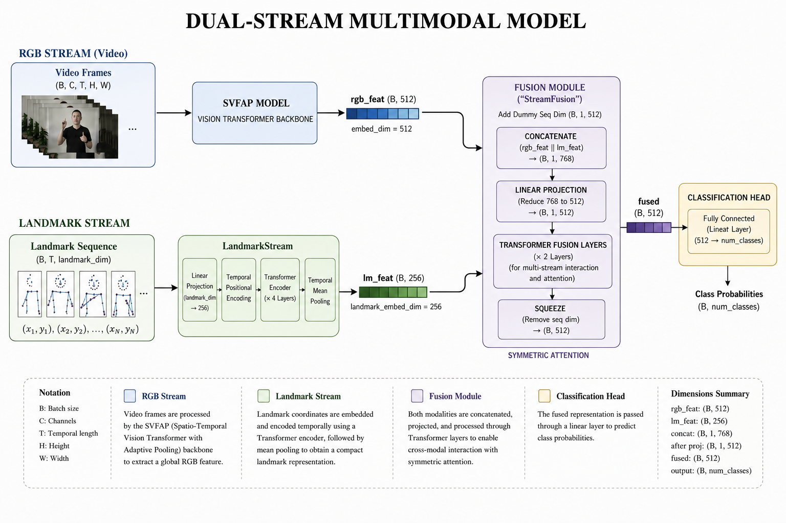
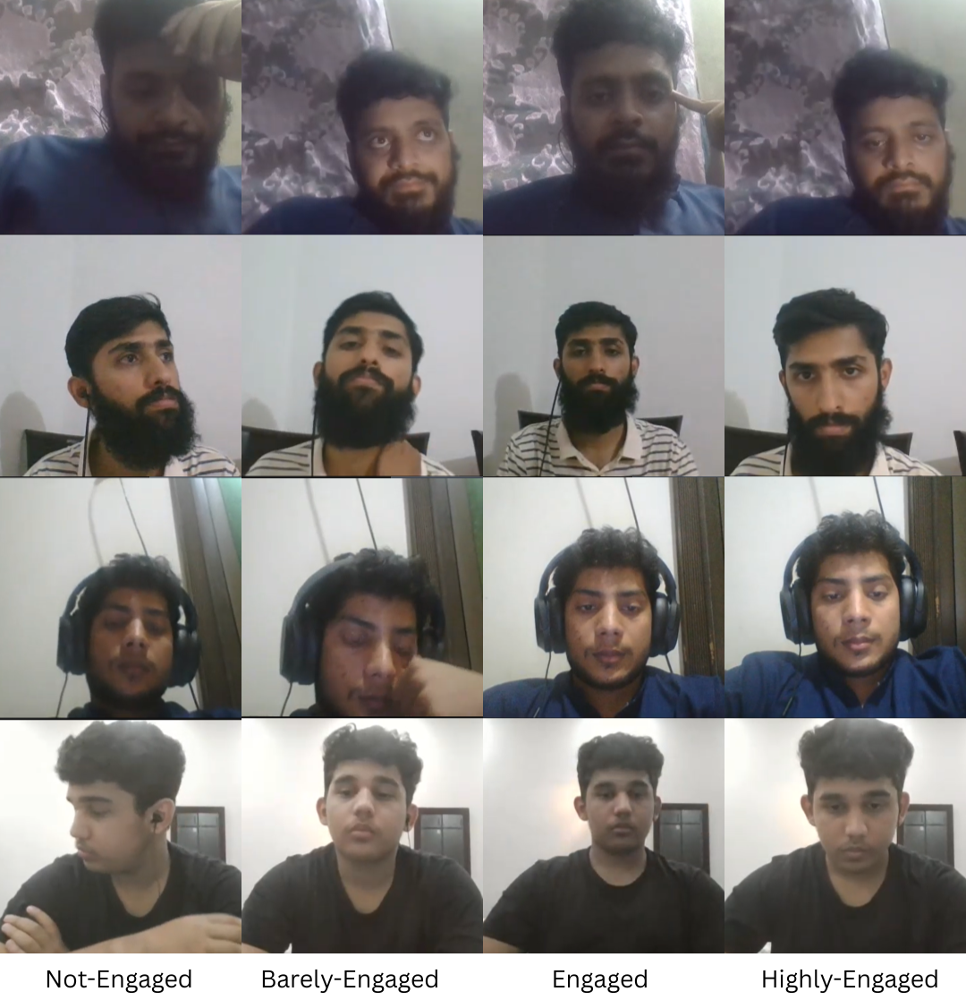

<div align="center">



# 🎭 DG-SVFAP
### Dual-Stream Visual-Geometric Spatiotemporal Facial Action Prior

**Real-time engagement detection for online meetings & e-learning**
*Extending SVFAP with a dedicated facial-landmark stream*

<br/>

[](https://smartmeet-platform.vercel.app/)
[](https://doi.org/10.1145/3577190.3614164)
[](https://doi.org/10.1109/TAFFC.2024.3432380)
[]()
[]()

<br/>

<table>
<tr>
<td align="center"><b>71.9%</b><br/><sub>Val Accuracy</sub></td>
<td align="center"><b>71.2%</b><br/><sub>Test Accuracy</sub></td>
<td align="center"><b>~37ms</b><br/><sub>Inference / 10s clip</sub></td>
<td align="center"><b>540</b><br/><sub>Concurrent Users</sub></td>
</tr>
</table>

</div>

<br/>

## 📖 Overview

**DG-SVFAP** extends [SVFAP](https://doi.org/10.1109/TAFFC.2024.3432380) *(Self-supervised Video Facial Affect Perceiver)* with a dedicated **facial-landmark stream**, fused through a lightweight Transformer, to jointly capture appearance-level spatiotemporal patterns and structured facial geometry — gaze, head pose, and eye blinks.

On **[EngageNet](https://doi.org/10.1145/3577190.3614164)**, the model reaches **71.9%** validation accuracy and **71.2%** test accuracy, outperforming MARLIN, TCCT-Net, and Ordinal ST-GCN.

A live demo, **SmartMeet**, runs real-time engagement inference in-browser at **~37ms** per 10-second clip on a single T4 GPU, supporting up to **540 concurrent participants**.

> 🔗 **[Try the SmartMeet live demo →](https://smartmeet-platform.vercel.app/)**

---

## ✨ Key Contributions

| | |
|---|---|
| 🧩 | **Dual-Stream Architecture** — a parallel facial-landmark stream running alongside the RGB video stream |
| 🔗 | **Cross-Modal Fusion Module** — concatenates RGB + landmark features, refined via a lightweight Transformer encoder |
| 📐 | **Landmark-Augmented Geometric Supervision** — MediaPipe landmarks capture gaze, head pose, and eye blinks |
| 🏆 | **SOTA on EngageNet** — outperforms all compared baselines |
| 💻 | **SmartMeet Deployment** — a browser-based, real-time engagement detection platform |
| 🌍 | **ROLE-D (Self-Collected)** — a real-world external dataset, personally collected and annotated, used solely for unseen-participant testing |

---

## 🏗️ Architecture

<div align="center">

</div>

| Module | Description |
|---|---|
| 🎥 **RGB Stream** | SVFAP backbone *(pre-trained on VoxCeleb2)* → `f_rgb ∈ ℝ⁵¹²` |
| 📍 **Landmark Stream** | Linear projection + learnable temporal positional encoding → 4-layer Transformer → temporal mean pooling → `f_lm ∈ ℝ²⁵⁶` |
| 🔀 **Fusion Module** | Concatenation → linear projection (768→512) → 2-layer Transformer for cross-modal attention |
| 🎯 **Classification Head** | Linear layer → engagement class scores |

---

## 📁 Dataset

### Training / Evaluation — EngageNet

<div align="center">

| Attribute | Value |
|---|---|
| Duration | 31 hours of video |
| Participants | 127 |
| Clips | 11,200 *(7.9k train / 2.2k test / 1k val)* |
| Classes | 4 engagement levels |
| Format | 16 frames/clip @ 160×160, MediaPipe landmarks pre-extracted as `.npy` |

</div>

### External Evaluation — ROLE-D 🟠 *self-collected*

**ROLE-D** *(Real-World Online Learning Engagement Dataset)* — 9 participants, natural home environments, fully unscripted. 1,003 ten-second clips, kept completely separate from training and validation, used exclusively to evaluate generalization on unseen participants.

<div align="center">


| Class | Share |
|---|---|
| 🟢 Highly Engaged | 65% |
| 🔵 Engaged | 16% |
| 🟡 Barely Engaged | 6% |
| 🔴 Not Engaged | 13% |

</div>

> **Note:** Unlike EngageNet, ROLE-D was independently collected, recorded, and labeled as part of this project — not sourced from an existing public dataset.

The RGB backbone initializes from an SVFAP checkpoint pre-trained on VoxCeleb2 *(1M+ segments, 6,000+ speakers, 145 nationalities)*. The landmark stream, fusion module, and classification head train from scratch; the full model is fine-tuned end-to-end.

---

## 🎓 Training Strategies

- ✅ **Full parameter fine-tuning**
- ✅ **LoRA** — replace the files in the `lora/` folder to use LoRA-based fine-tuning

---

## 📊 Results

<table>
<tr>
<td valign="top" width="50%">

**🏆 SOTA Comparison** *(EngageNet Val)*

| Method | Val Acc |
|---|---|
| ResNet-TCN | 54.2% |
| CNN-LSTM | 65.2% |
| CNN-BiLSTM | 66.1% |
| MARLIN | 68.4% |
| TCCT-Net | 68.9% |
| Ordinal ST-GCN | 71.2% |
| **DG-SVFAP (Ours)** | 🥇 **71.9%** |

</td>
<td valign="top" width="50%">

**🔬 Ablation Study**

| Configuration | Val Acc |
|---|---|
| Landmark Only | 64.5% |
| SVFAP (RGB only) | 69.0% |
| Full Model w/o Aug. | 66.0% |
| **DG-SVFAP (Full)** | 🥇 **71.9%** |

</td>
</tr>
</table>

---

## 🚀 SmartMeet — Live Deployment

<div align="center">

| Component | Details |
|---|---|
| 🖥️ Client-side | Face detection + landmark extraction, fully in-browser |
| ☁️ Server-side | Inference on T4 GPU backend |
| ⚡ Latency | ~37ms per 10-second clip |
| 📈 Scale | Up to 540 concurrent participants, horizontally scalable |

**🔗 [smartmeet-platform.vercel.app](https://smartmeet-platform.vercel.app/)**

</div>

---

## 🛠️ Setup

```bash
git clone https://github.com/Salal04/DG-SVFAP.git
cd DG-SVFAP
pip install -r requirements.txt
```

**Training**
```bash
python train.py --dataset engagenet --backbone svfap_checkpoint.pth --epochs 20 --batch_size 4
```

**Inference**
```bash
python infer.py --video path/to/clip.mp4
```

> ⚠️ Update the commands above to match your actual scripts/CLI once finalized.

---

## 📌 Model Details

| Parameter | Value |
|---|---|
| Landmark dimension (`D_lm`) | 256 |
| Landmark Transformer layers | 4 |
| Fusion Transformer layers | 2 |
| Training | 20 epochs, batch size 4, end-to-end fine-tuning, cross-entropy loss |
| Augmentation | Random cropping, horizontal flipping (RGB) with matching landmark keypoint flips |

---

## 🔭 Future Work

- 🎙️ Incorporating audio/speech features for richer multimodal signals
- 🎥 Validating generalization on Zoom, Microsoft Teams recordings
- 🧪 Semi-supervised / active learning to reduce labeled-data dependence
- 🌐 Scaling deployment beyond a single GPU instance

---

<div align="center">

## 👤 Author

**Salal Shabbir**
Department of Software Engineering, University of the Punjab, Lahore, Pakistan

</div>

---

## 📄 Citation

```bibtex
@article{dgsvfap2026,
  title={DG-SVFAP: Dual-Stream Visual-Geometric Spatiotemporal Facial Action Prior},
  institution={University of the Punjab},
  year={2026}
}
```

<div align="center">
<sub>Made with 🎭 for more human-aware online learning</sub>
</div>
